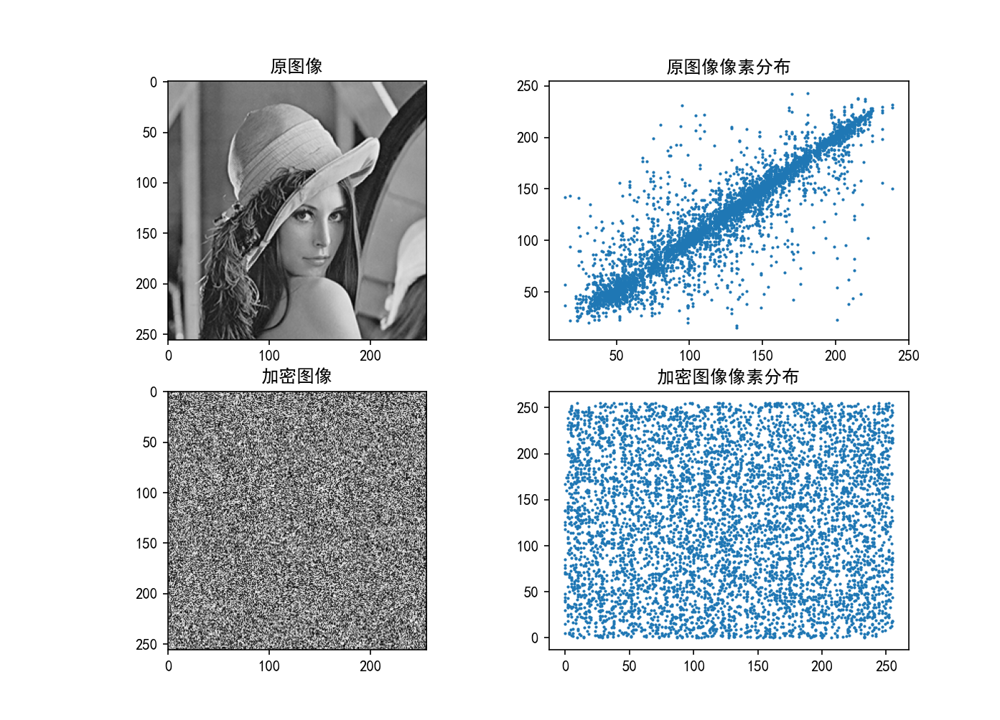

# 一种新的基于混沌映射的比特级图像加密算法

> 原论文题目：A novel bit-level image encryption algorithm based on chaotic maps
> 链接：https://doi.org/10.1016/j.optlaseng.2015.09.007

数字内容安全大作业1

## 介绍

- 本项目为论文 [A novel bit-level image encryption algorithm based on chaotic maps](https://doi.org/10.1016/j.optlaseng.2015.09.007) 中提出的图像加密算法的 python 实现，复现了加密算法、解密算法以及性能分析
- 原文提出的算法并不复杂，然而对 python 的矩阵运算方法掌握不熟练导致很久才成功复现（~~家人们，谁懂啊，被 numpy 的 `reshape()` 的下头参数顺序气晕~~）

## 目录结构

- `.git`
- `gray_encrypt`
  - `analysis`
    - `__init__.py`
    - `correlation.py`: 相邻像素相关性分析
    - `differencial.py`: 差分攻击分析
    - `entropy.py`: 信息熵分析
    - `histogram.py`: 直方图分析
    - `sensitivity.py`: 密钥敏感测试
  - `images`: 实验图片存放路径
    - `lena.bmp`
    - `lena.png`
    - `rabbit.jpg`
  - `params`: 密钥存放路径
  - `decrypt.py`
  - `encrypt.py`
  - `main.py`: 主函数，加解密 + 性能分析
  - `utils.py`: 图像的位平面分解 + 生成混沌映射序列
- `img`
- `.gitnore`
- `LICENSE`
- `README.md`

## 使用方法

- 新建 python 虚拟环境
- 激活虚拟环境，安装依赖：`pip install -r requirements.txt`
- 运行代码
  1. 加解密 + 性能分析：将要处理的图像放到 `images` 目录下，修改 `main.py` 第 4 行的图像路径，运行 `python main.py`
  2. 如果要单独执行/不执行某一个方法，请自行在 `main.py` 中添加/注释对应的函数（注意传参）

## 实验结果

以 lena 图为输入，执行的结果如下

- 加密图像
  

- 解密图像
  

- 直方图分析
  

- 相关性分析
  

- 加密密钥敏感性分析
  

- 解密密钥敏感性分析
  

- 其他分析数据
  

## TODO

- [ ] 调整密钥所包含的项目（原算法中除混沌映射初始值外还必须保存每轮扩散后的序列的第一项）
- [ ] 基于此算法实现彩色图像的加密