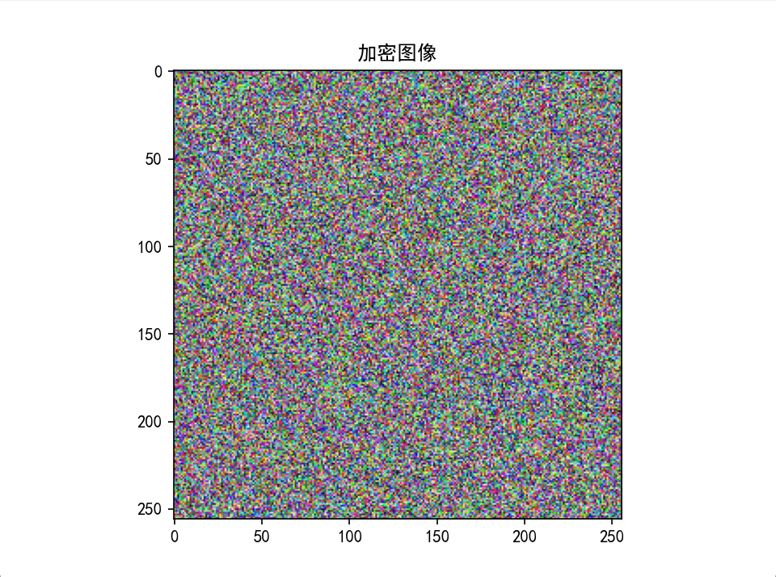

# 基于混沌映射与位平面分解的彩色图像加密算法实验

数字内容安全结课作业代码

## 介绍

- 本项目为数字内容安全结课作业论文中提出的图像加密算法的 python 实现，完成了加密算法、解密算法以及性能分析。

## 目录结构
```
- analysis/
  - __init__.py
  - bifurcation.py: 分岔图
  - correlation.py: 相邻像素相关性分析
  - differencial.py: 差分攻击分析
  - entropy.py: 信息熵分析
  - histogram.py: 直方图分析
  - sensitivity.py: 密钥敏感测试
- docs/: 实验结果记录
  - img/: 实验截图
    - ...
  - 实验过程录像.mp4
- images/: 实验图片存放路径
  - ...
- params/: 密钥存放路径
  - ...
- decrypt.py：（核心算法）加密函数
- encrypt.py：（核心算法）解密函数
- main.py: 主函数，加解密 + 性能分析
- utils.py: 图像的位平面分解 + 生成混沌映射序列
- requirements.txt: 程序所需的 python 第三方依赖库
- result.txt: 数据结果文件
- README.md
```
## 使用方法

- 需要 python 版本>=3.9

- 新建 python 虚拟环境。以 anaconda 为例，执行：

```shell
conda create -n encrpyt python=3.9
conda activate encrypt
```

- 激活虚拟环境后安装依赖（如果不需要使用虚拟环境则直接安装依赖）：

```shell
pip install -r requirements.txt
```

- 运行代码
  1. 加解密 + 性能分析：将要处理的图像放到 `images` 目录下，修改 `main.py` 第 7 行的图像名称（注意加后缀，默认为 lena 图），运行 `python main.py`
  2. 如果要单独执行/不执行某一个方法，请自行在 `main.py` 中添加/注释对应的函数（注意传参）

## 加密效果展示

选择四组不同宽高比例的图像进行加密，得到的结果如下：


## 实验过程记录

以 lena 图为输入，执行的结果如下

- 分岔图
  
  

- 加密图像
  
  

- 解密图像

  

- 直方图分析

  

  

- 相关性分析

  

  

- 密钥敏感性分析

  

  

- 其他分析数据（保存在 `result.txt` 文件中）

```
 +---------------------------------+
|        加解密过程的性能分析         |
 +---------------------------------+

=======原始图像的各方向的相关系数=======
通道	Horizontal	Vertical	Diagonal
 R		 0.9392		  0.9687		 0.9024
 G		 0.9075		  0.9439		 0.8756
 B		 0.8991		  0.9356		 0.8702

=======加密图像的各方向的相关系数=======
通道	Horizontal	Vertical	Diagonal
 R		 0.0234		  0.0420		-0.0096
 G		-0.0144		  0.0076		 0.0015
 B		-0.0075		 -0.0095		-0.0041

====原图像信息熵====
通道R:		7.0345
通道G:		7.3485
通道B:		6.9985

===加密图像信息熵===
通道R:		7.9974
通道G:		7.9972
通道B:		7.9973

========NPCR========
Red  :	99.6536%
Green:	99.6506%
Blue :	99.5773%

========UACI========
Red  :	33.6691%
Green:	33.5097%
Blue :	33.5444%


 +---------------------------------+
|    100次相关性分析和差分攻击分析    |
 +---------------------------------+

=======原始图像的各方向的相关系数=======
通道	Horizontal	Vertical	Diagonal
 R		 0.9385		  0.9701		 0.9056
 G		 0.9090		  0.9537		 0.8830
 B		 0.8954		  0.9354		 0.8555

=======加密图像的各方向的相关系数=======
通道	Horizontal	Vertical	Diagonal
 R		 0.0016		 -0.0052 	  0.0081
 G		-0.0027		  0.0113 	 -0.0035
 B		 0.0034		  0.0040 	 -0.0009

========NPCR========
Red  :	99.6246%
Green:	99.6368%
Blue :	99.6323%

========UACI========
Red  :	33.4701%
Green:	33.5498%
Blue :	33.3755%
```